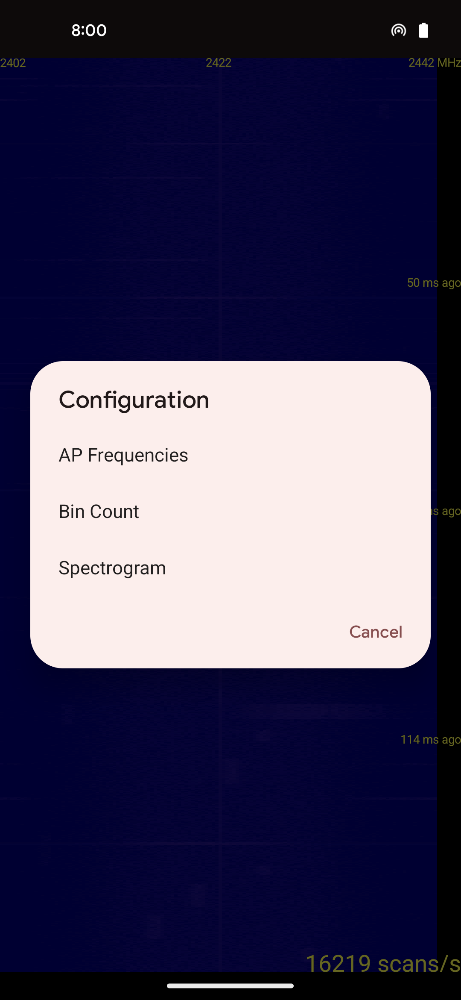
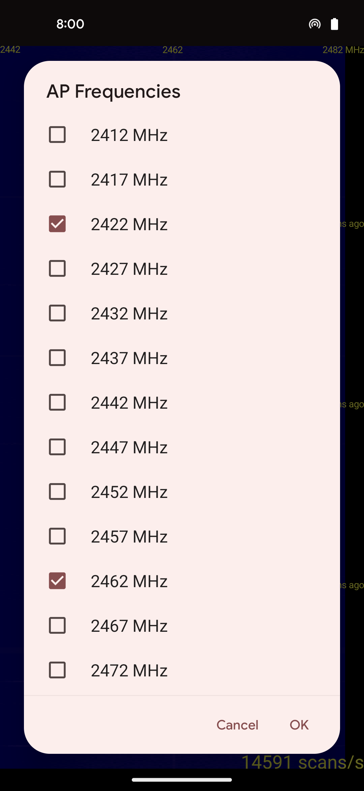

# SoftSA

An RF spectrum analyzer app for Android phones using only built-in hardware.

## Requirements

This app requires an Android phone with the following:

- Android 7 or above (tested on Google Pixel 5 with Android 11 and Android 14)
- Root access (e.g. using [Magisk](https://github.com/topjohnwu/Magisk/))
- Qualcomm qcacld-3.0 driver

## Installation

Download the APK file built by GitHub Actions from the [Releases](https://github.com/zlab-pub/SoftSA/releases) page and install it using `adb install`.

Alternatively, build the app on a Linux system with JDK 17 (or above) and Android SDK 34 by running `./gradlew assembleDebug`, which produces an APK file at `app/build/outputs/apk/debug/app-debug.apk`.

## Usage

Many Qualcomm chips' spectral scan feature can only cover a 40 MHz range centered at the frequency of the current Wi-Fi channel. Therefore, it's better to run this app with hotspot enabled and "Turn off hotspot automatically" disabled. The app will then periodically switch the channel of the hotspot to cover different frequency ranges. If enabling hotspot before launching the app doesn't work, try enabling hotspot after launching the app instead.

This app shows a spectrogram on the screen, where brighter colors indicate higher FFT magnitudes. This app also employs a simple algorithm to detect Bluetooth transmission and estimate its strength. The following is a screenshot of the app in the presence of Bluetooth transmission.

A short click on the screen pauses or resumes the scanning, while a long click shows a configuration dialog:

